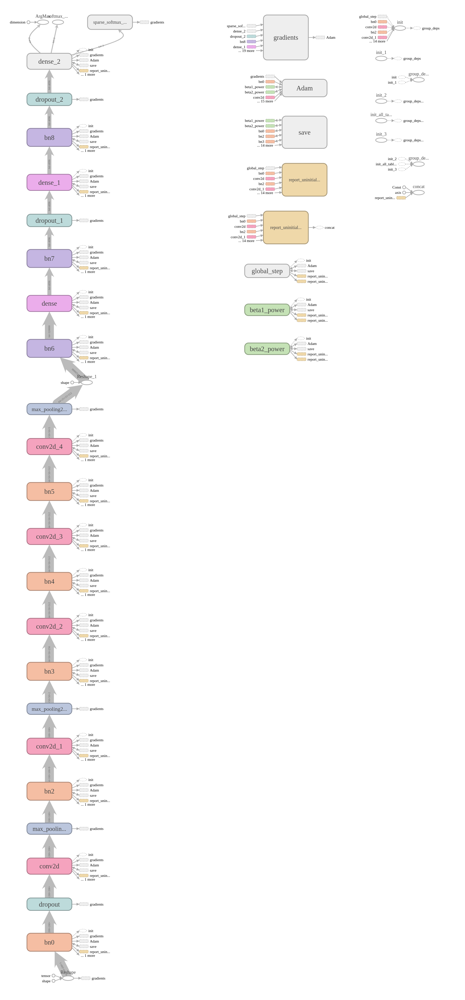
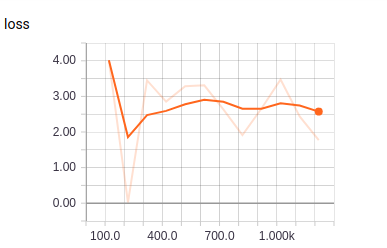
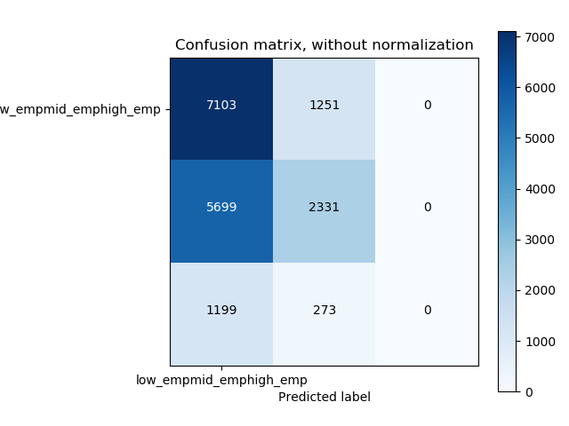
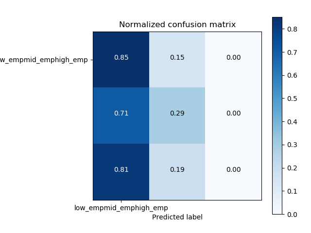

# Emp_from_Landsat
Predicting Employment from Landsat data of villages

Dataset preprocessing:
Set the path of dataset and employment labels in train.py and test.py
Input images have 12 bands in which band 12 is corresponding to nightlight and band 13 corresponding to Landsat image quality. These bands are deleted and ndvi, ndwi, ndbi, ui ,evi bands are added making total number of bands in image 16.
Images are then padded with 0 to make them equal size (200*200*16).
This image is now feed into a modified VGG-M network.

CNN Architecture:

The network used is similar to VGG-M with batchnorm layers after each conv layers and dropout at the input layer.
The input image size(200*200*16) is also different from that in standard VGG-M architecture(224*224*3) which results into fc layers weight of different size. 

Training:
To train vggm netork:
nohup python train.py > log,txt 2>&1 &

To visualize tensorboard run on vm:

ssh from local system using:
ssh -L 16006:127.0.0.1:6006 <username@ip>

run tensorboard on vm :
nohup tensorboard --logdir= <directory of saved model>       > tensorboard_out.txt 2>&1 &
 
open tensorboard on local machine:
http://localhost:16006

Training network with learning rate of 1e-4 for 200 iterations and then 1e-5 gives following loss plot:

Evaluating model on test data:

To evaluate the model performance on test data:

nohup python test.py > eval_log.txt 2>&1 &

To plot confusion matrix:

python plot_confusion_matrix.py

Results:

Unnormalized Confusion matrix:

Normalized Confusion matrix:

